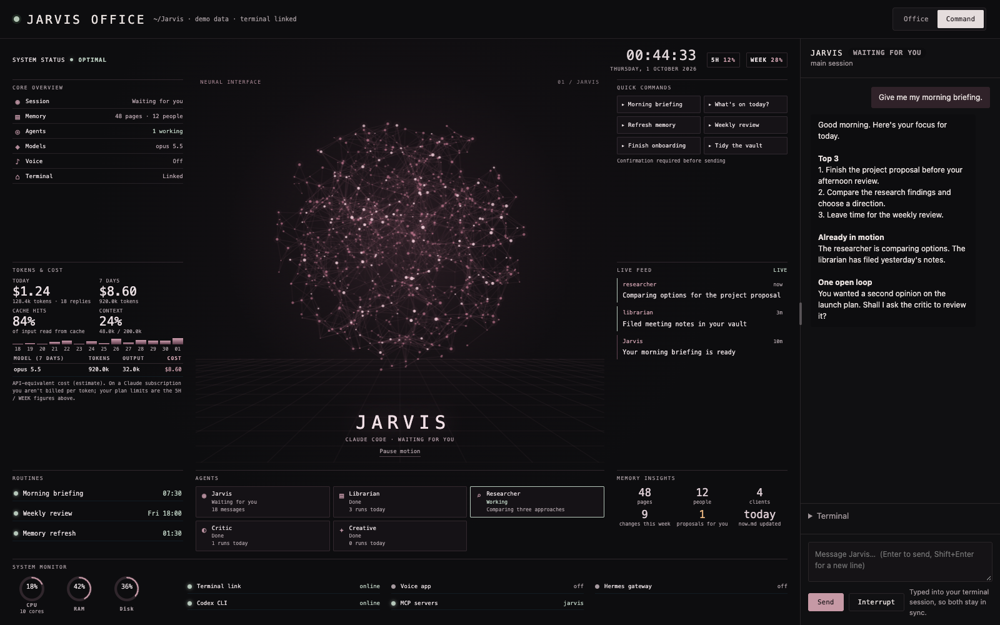
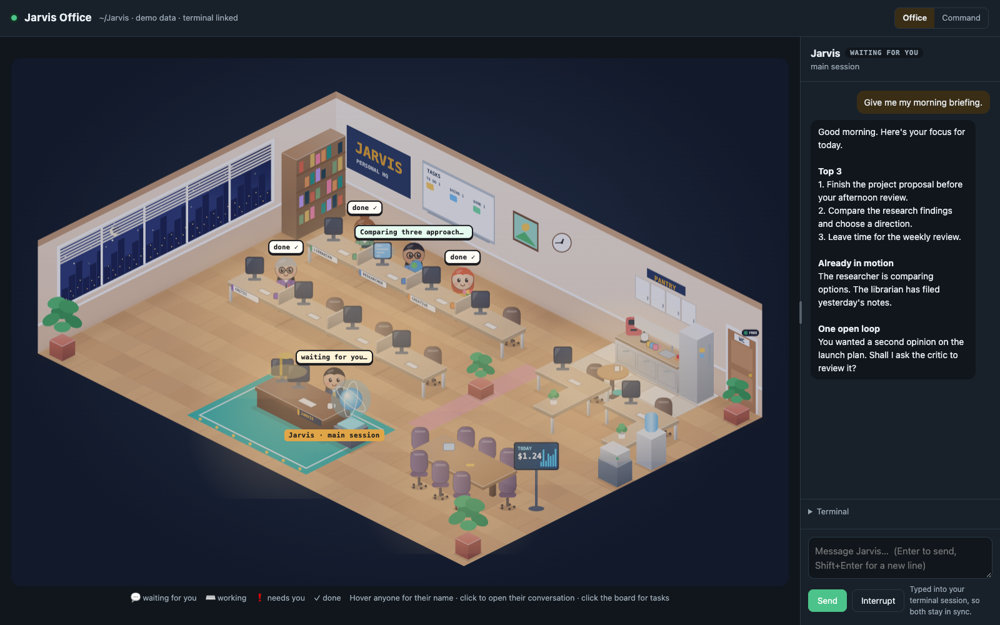
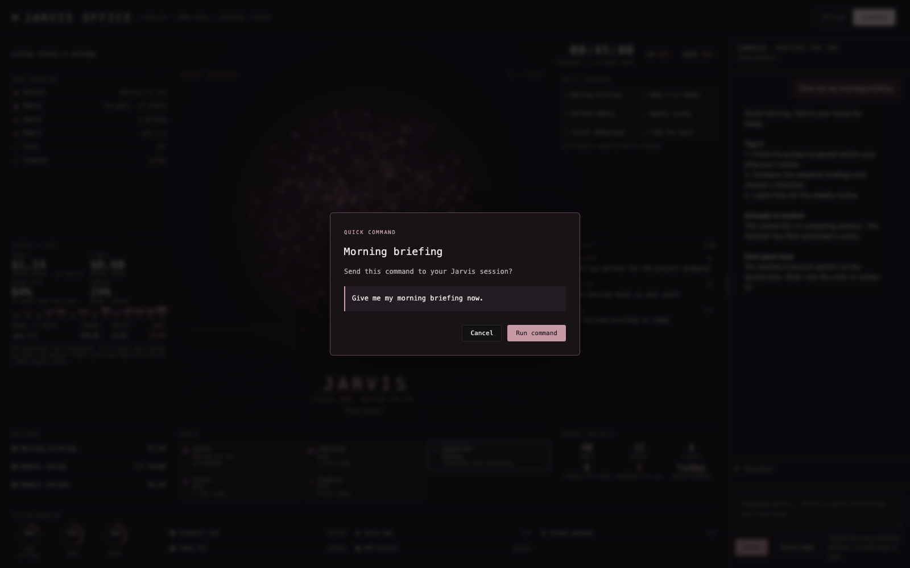

# Jarvis

[](https://github.com/JohannsenLum/jarvis/actions/workflows/ci.yml)
[](https://github.com/JohannsenLum/jarvis/actions/workflows/codeql.yml)

A personal assistant with a memory you own and a live dashboard you can work from.

Jarvis keeps track of your work, people, goals and preferences in a plain Markdown vault. It helps you
plan the day, prepare for decisions, research questions and follow through on commitments. You choose
its role, tone and how much it can do on its own.

It plugs into the AI tools you already use—Claude Code, Codex, Gemini, Cursor, Hermes and others—with
one identity, one vault and a shared set of skills. The optional **Office dashboard** is a local browser
interface for your Claude Code session: a living pixel-art office or a dark **Command** view with a
particle core, live activity and a resizable conversation panel.



*Command view. All screenshots below use fictional demo data.*

## What Jarvis does

| Capability | What it helps you do |
|---|---|
| Remember your context | Keep people, clients, projects, goals and decisions in linked Markdown pages; recall them in later conversations |
| Plan and review | Get a morning briefing, review your week, track open loops and refresh your short-term memory |
| Research and decide | Ask for sourced research, an independent critique or a structured decision framework |
| Delegate work | Give focused jobs to the librarian, researcher, critic and creative in tools that support sub-agents |
| Connect your tools | Work with the services you configure, such as Google, Apple, GitHub and Obsidian |
| Follow work live | Read the main and sub-agent conversations, inspect the task board, answer prompts and confirm quick commands from the dashboard |

Start with “What's on today?”, “Remember this about my client”, “Research this and give me a second
opinion”, or “Let's do my weekly review”. Connections and scheduled routines need to be configured;
the dashboard reflects the session and data available in your Jarvis folder.

## Get started

```bash
npx github:JohannsenLum/jarvis
```

A two-minute wizard asks your name, what to call your assistant, its role, tone and how much it may do
on its own, and builds your Jarvis folder (default `~/Jarvis`). Then open that folder:

- **Claude desktop app** (recommended): open `~/Jarvis` in the Code section.
- **Terminal:** `cd ~/Jarvis && claude` (or `codex`, `gemini`, …).

Say hi. Jarvis takes it from there. On first open, approve the folder's `jarvis` tools when asked.

Needs macOS, Node 18+, Python 3 and git (`xcode-select --install` covers Python and git).

## Onboarding: five chapters, about eight minutes

Jarvis interviews you in a chat that builds your second brain as you answer. You tap answers instead of
typing, and you can skip anything or say "pause" and pick up later.

```
◆◇◇◇◇  1 · Meet            role, tone, autonomy, with a preview of how each one sounds
◆◆◇◇◇  2 · Your world      work, clients, life areas, the people who matter
◆◆◆◇◇  3 · What matters    goals, the ideas you decide by, a framework to try
◆◆◆◆◇  4 · Your rhythm     which routines, what your briefing covers, when; chat and voice
◆◆◆◆◆  5 · Connect         Google, Apple, GitHub…; privacy per area; bring in existing folders
```

After each chapter you see the pages it created (`+ relationships/people/sam.md`). It ends with your
vault, a short "who I think you are" card you can correct, your first briefing time, and three things to
try. Anything you skip is saved and offered again later ("finish onboarding").

## Your folder

```
~/Jarvis/
  knowledge/        your second brain (open it in Obsidian). Yours; updates never touch it
  skills/           your own skills. A copy of a Jarvis skill here overrides the original
  CLAUDE.md  AGENTS.md  GEMINI.md    Jarvis's identity in a marked block; add your own notes around it
  .claude/ .agents/ .codex/ .gemini/ .mcp.json    wiring for each AI tool (generated)
  .jarvis/          Jarvis itself: replaced wholesale by `jarvis update`, so no merge conflicts
```

- **Updates:** `jarvis update` swaps `.jarvis/` for the latest version and re-renders the wiring. Your
  vault, skills, notes and settings stay as they are.
- **Only in this folder by default.** Want Jarvis in every folder? `jarvis install claude-code --global`.
- The wizard makes the folder a private git repo. If you push it anywhere, keep that remote **private**.

## How it works day to day

- **Short-term memory:** `knowledge/now.md` (this week's focus, open loops, next 7 days) is read at the
  start of every conversation and rewritten every night.
- **Recall:** mention a person, client or project and Jarvis pulls in its page automatically.
- **Filing:** tell it something worth keeping and it files it on the right page, logging every change in
  `log.md`. Your own pages in `me/` are never edited without a yes (changes are proposed in
  `me/_proposals.md`).
- **Routines:** a morning briefing, a weekly review, and a nightly memory refresh and tidy-up.
- **Frameworks:** proven ways of thinking Jarvis runs with you (below).
- **Sub-agents:** a librarian, researcher, critic and creative it hands work to (below).

## Office dashboard

```bash
cd ~/Jarvis
jarvis office          # opens the dashboard; Claude runs in the background
```

The command opens an authenticated dashboard at `http://127.0.0.1:3777`. Launch it through `jarvis office`
rather than a shared or bookmarked URL; after a server restart, run the command again to reconnect.
It follows the Claude Code session in your Jarvis
folder, including its transcript, sub-agent runs, permission requests and terminal prompts. The
assistant's identity and vault also work in other supported tools; this dashboard currently connects
to Claude Code.

### How it looks

Switch between **Office** and **Command** in the top bar. Jarvis remembers your selected view.

| View | Look and layout | What you can explore |
|---|---|---|
| **Office** | A warm isometric pixel-art workspace with desks, day/night windows, a pantry and animated characters | Jarvis and four specialist agents, a live task board and the glowing Brain that represents your vault |
| **Command** | A charcoal interface with muted rose accents, a rotating particle network with perspective and depth, fine grid lines and compact status panels | Session status, usage, quick commands, live activity, routines, agents, memory and system health |

**Office** turns session activity into a shared workspace. Click a character to read its conversation,
the board for To do / Doing / Done, or the Brain for `now.md` and **Open in Obsidian**. Click empty space
to clear the selection and return the side panel to Jarvis's chat.

**Command** puts the overview around the particle core. Its compact desktop layout brings routines,
agents, memory and system indicators onto the same screen; long lists scroll within their panels.
Smaller screens stack the content vertically. The core has a **Pause motion** control.



*Office view: click an agent, the task board or the Brain to explore the session.*

### Conversation and controls

- **Resize the chat.** Drag the conversation panel's left divider to make it wider or narrower. The
  width is saved in your browser. Double-click to reset; focus the divider and use arrow keys for
  keyboard resizing. On mobile, the conversation stacks below the dashboard.
- **Read and reply in one place.** Select Jarvis or an agent to see its conversation. Messages to a
  sub-agent are sent through Jarvis. The terminal mirror shows prompts that need keyboard interaction.
- **Confirm quick commands.** Morning briefing, What's on today?, Refresh memory, Weekly review,
  Finish onboarding and Tidy the vault each show the exact message before sending. Choose **Run
  command** to proceed, or **Cancel** / Escape to dismiss. This is a confirmation step, not two-factor
  authentication.
- **Handle approvals.** Permission requests appear as Allow / Deny controls. Answer from the dashboard
  or terminal; the resolved request clears from the other side. The terminal mirror includes arrow,
  Space, Enter and Escape controls for pickers and prompts.

<details>
<summary>Preview: confirming a quick command</summary>



Review the message before it reaches your session. Cancel or Escape dismisses it without sending.

</details>

### What the numbers mean

Command shows today's and seven-day token usage and API-equivalent cost, per-model totals, cache hits,
context usage, agent runs, recent activity, routines, vault statistics, CPU/RAM/disk and service status.
The 5-hour and weekly plan-usage figures appear when available from the Claude app.

API-equivalent cost is an estimate of usage, **not an extra bill on top of a Claude subscription**.
An empty conversation or offline state means the dashboard has not found a session for its configured
folder; make sure you launch it from your actual Jarvis instance, usually `~/Jarvis`.

### Start, attach and stop

```bash
jarvis office                         # open the dashboard
jarvis office --attach                # also attach to Claude in this terminal
jarvis office --no-remote-control     # start without Claude Remote Control
jarvis office status                  # check the dashboard and background session
jarvis office restart -- --model opus # restart Claude with different flags
jarvis office stop                    # stop the dashboard server; Claude keeps running
jarvis office stop-all                # stop the dashboard server and its Claude tmux session
```

By default, Claude starts in tmux with Remote Control enabled, so you can also access that session
through Claude's Remote Control interface. Use `tmux attach -t jarvis` to attach directly in a terminal.
The installer offers to install tmux, and `jarvis office` checks for it when starting.

The dashboard server binds to `127.0.0.1` and uses a per-run token. Remote Control is a separate Claude
feature; the local dashboard itself is not exposed to the network. Close any open dashboard tabs when
finished: stopping the server does not close browser tabs or stop an already-loaded animation.

Claude flags can be passed after `--`. `--dangerously-skip-permissions` disables Claude's permission
prompts and therefore its dashboard approval cards; quick-command confirmation remains a separate
interface control.

## Routines

Everything runs locally on your Mac. Jarvis sets up the routines you pick in onboarding, where you
actually use it:

| You use | Routines run as | Turn off, edit, change time |
|---|---|---|
| Claude desktop app | Local routines (the app's Routines page) | On the Routines page, or ask Jarvis |
| Claude Code in the terminal, or Codex | macOS launchd jobs (`jarvis schedule sync`) | Ask Jarvis (it edits `me/routines.md`), then run `jarvis schedule sync`; `jarvis schedule status` shows each last run |
| Hermes | Hermes cron | Ask Jarvis, or `hermes cron list` |

What each routine covers lives in `knowledge/me/routines.md`, which you can edit in Obsidian or change by
chat ("move my briefing to 8", "stop the weekly review", "add email highlights"). Scheduled runs use the
lighter model (Sonnet 5 or GPT-6 Luna). Routines only run while the Mac is awake; a missed one runs
when it wakes (in the desktop app: when the app is next open).

| Routine | When | What |
|---|---|---|
| Morning briefing | Your time, e.g. 07:30 | Top 3 for today, heads-ups, people to reach out to |
| Weekly review | Your day, 18:00 | Wins, goals progress, 168 audit if you use it |
| Nightly memory refresh | 01:30 | Files the day's facts and promises, rewrites `now.md` |
| Nightly tidy-up | 02:00 | Inbox, broken links, duplicates |

## Frameworks

Proven ways of thinking Jarvis can run with you. The frameworks live in `.jarvis/frameworks/` (ours,
updated); your results live in `knowledge/frameworks/<name>/` (yours, never touched).

| Framework | What it does |
|---|---|
| 168-hour week | Budget your week like money: sleep, health and people first, work gets the rest. Audited weekly |
| AIOO | Actions × Inputs → Outputs → Outcome: plan backwards; when nothing moves, fix purpose first |
| Declarations | Goals written as who you are ("I am…"), read daily, reviewed against reality |
| Deal cards | A card for every live opportunity (context, BANT, next step), tied to the person |

Say "let's do the 168", "run AIOO on this goal" or "make a deal card for this". Jarvis also offers one
when it fits. From [twiss-io/lifeos-plugin](https://github.com/twiss-io/lifeos-plugin); see
`frameworks/README.md`.

## Roles

| Setting | Options |
|---|---|
| Role | **Chief of Staff** (default): runs your priorities, preps you, pushes back · **Executive Assistant**: calendar, admin, logistics · **Thinking Partner**: strategy and decisions · **Coach**: goals, habits, accountability · **Life Manager**: family, home, money |
| Tone | warm · formal · direct |
| Autonomy | ask-first · act-and-tell (default) · handle-quietly |

At every level Jarvis asks before sending, posting, spending money or credits, deleting, changing
events other people attend, or editing `me/`. Borrow a role for one conversation ("thinking partner
mode: should I raise prices?") or change it for good ("from now on, be my coach").

## Sub-agents

In tools that support them (Claude Code), Jarvis hands jobs to four workers. Each exists for a reason: a
clean context, limited permissions, a different model, or independence. Domain know-how (sales,
development) lives in skills, not agents.

| Sub-agent | Job | Model | Can't |
|---|---|---|---|
| librarian | Filing, nightly memory refresh, tidy-up | Sonnet 5 | browse the web, send, delete |
| researcher | Web and vault research, sourced summaries | Sonnet 5 | write anything (keeps web content out of memory) |
| critic | Independent second opinion, pre-mortems | Opus 5.5 | change anything |
| creative | Higgsfield images and video, diagrams | Sonnet 5 | publish, or spend credits without a yes |

## Connections

Set up one at a time in onboarding, or later ("connect my Google"). Each can be skipped.

| Connection | Gives Jarvis |
|---|---|
| Google | Gmail, Calendar, Drive, Docs, Sheets, Contacts |
| Apple | Reminders, Notes, iMessage |
| Obsidian | Your vault, with graph view and backlinks |
| Work files | Word, Excel, PowerPoint, PDF |
| GitHub · Vercel · Cloudflare | Code, deployments, domains |
| Higgsfield | AI images and video (uses your credits, asks first) |

Tokens and passwords never go through chat.

## Models

| Connected | Chats | Scheduled jobs |
|---|---|---|
| Claude subscription | Opus 5.5 | Sonnet 5 |
| ChatGPT/Codex subscription | GPT-6 Sol | GPT-6 Luna |
| Both | The one you choose leads; the other takes over if it's down or rate-limited | |

Setup detects what you're already signed in to and only asks about what it can't find. Ask for a
specific model for one job any time ("use GPT Astra for the pricing analysis").

## Works with

In your Jarvis folder, Claude Code, Codex and Gemini pick Jarvis up automatically. For other tools, or to
have Jarvis everywhere:

```bash
jarvis install claude-code --global   # or: codex | deepseek | hermes | openclaw | cursor | gemini | claude-desktop | all
jarvis doctor                         # what's installed where
jarvis uninstall codex                # removes only what Jarvis added
```

| Tool | Skills | Identity | Jarvis tools | Recall |
|---|---|---|---|---|
| Claude Code (app and terminal) | `.claude/skills` | `CLAUDE.md` | MCP | hook |
| Codex | `.agents/skills` | `AGENTS.md` | MCP | hook |
| Gemini CLI | `.agents/skills` | `GEMINI.md` | MCP | tool |
| Cursor, DeepSeek Harness, OpenClaw | `~/.agents/skills` | rules / `AGENTS.md` | MCP | tool |
| Hermes | skills dir | `SOUL.md` | MCP | plugin |
| Claude desktop chat | upload zips (`jarvis export-skills`) | MCP instructions | MCP | tool |

It also installs as a Claude Code plugin (`claude plugin marketplace add <this repo>` then
`claude plugin install jarvis@jarvis`). Use either the plugin or `jarvis install`, not both.

## Advanced: Hermes as an always-on home

For Telegram and desk voice today, Jarvis can live in [Hermes Agent](https://hermes-agent.nousresearch.com)
on your Mac. Telegram and voice through Claude are coming.

```bash
jarvis setup hermes           # guided, re-runnable
jarvis setup hermes --voice   # just the desk voice app
```

It installs Hermes if needed, connects your Claude or ChatGPT subscription, plugs Jarvis in, and
optionally sets up:

- **Telegram:** a DM, topics in your DM, or a group with topics (`adapters/hermes/telegram_mode.sh`).
- **The gateway** as a login service.
- **Desk voice** ([`jarvis-voice`](https://github.com/JohannsenLum/jarvis-voice)): say "Jarvis, …" or hold
  the talk key. The optional Jev key makes Mac commands instant. By default the talk key replaces Caps
  Lock; undo with `~/Documents/jarvis-voice/scripts/uninstall-capslock.sh`.

Hermes also brings its own dashboard (`hermes dashboard`: usage, sessions, cron).

## Privacy

- The vault is never shared. `life/health`, `life/finance`, `relationships/`, `journal/` and
  `frameworks/declarations/` default to local-only, and Jarvis never pastes them into other tools or
  group chats.
- Keys and tokens live in env files with mode 600 (for example `~/.hermes/.env`), never in the vault or chat.
- Content from the web, email or documents is treated as information, not instructions.

## Development and releases

CI checks syntax, vault safeguards, dashboard authentication and installation from the packed package
on Node 22/Python 3.11 and Node 24/Python 3.13 in isolated offline containers. CodeQL analyzes JavaScript
and Python, and Dependabot proposes dependency/tooling updates. Version tags create draft GitHub
releases with checksums after CI passes; no server deployment or npm publication runs automatically.

See [production readiness and release instructions](docs/production-readiness.md) and the
[security policy](SECURITY.md) for testing, coverage limits and responsible reporting.

## Platform

macOS only for now (Apple Silicon). Jarvis runs natively on your Mac with no Docker or separately
hosted server to manage. The optional dashboard starts a local Node server; model requests and
connected services use their respective providers.

## Repo layout

```
core/            identity template, roles, jarvis_core (vault rules, recall, identity, frameworks)
mcp/             the Jarvis MCP server (standard-library Python)
hooks/           recall hooks
agents/          librarian, researcher, critic, creative
skills/          jarvis/ (onboarding, routines, brain, frameworks…) · packs/ (agency, employee, CEO, freelancer) · vendor/
frameworks/      168, AIOO, declarations, deal cards
adapters/hermes/ optional Hermes home: setup, recall plugin, Telegram modes
office/          the office dashboard (Node, no dependencies)
bin/             jarvis CLI, create-jarvis wizard, scheduler, helpers
knowledge/       vault template (SCHEMA.md, page templates)
.claude-plugin/  Claude Code plugin manifests
```
